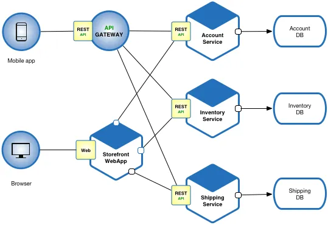
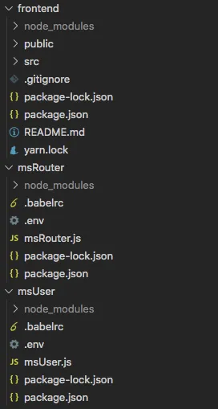

article: https://medium.com/@the.park/node-js-event-driven-microservice-architecture-using-rabbitmq-socket-io-and-react-frontend-6aa803658a22

## Event driven microservices Node.js, Socket.io, RabbitMQ and React frontend
In this guide i’ll walk you through the basic environment and communication configuration that you’ll need to build an event-driven microservice architecture. In the end, it would look something like this:



Except we wont be using rest apis between our services, but events. For now, we’re just going to start with the basic three services which you’ll need in most projects: FRONTEND — ROUTER (API) — USER SERVICE.

1. (Step 1) Setting up the environment
2. (Step 2) Creating the server
3. (Step 3) Connecting our Frontend
4. (Step 4) RabbitMQ and msUser
- Discussion
- References

### Setting up the environment

```
yarn create react-app client
cd client
yarn start
```
Next, we will need a router service that our react app will communicate with and a user service, that will deal with all user related stuff. So lets make two more directories in the root folder of your project.

```
// if you're not at root yet
cd ..
mkdir msRouter
mkdir msUser
```
Now lets initialise them by creating a main js file in each directory and running `yarn init`

```
// do this for msUser as well
cd msRouter
touch msRouter.js
yarn init
```

Now we have to add a few basic node packages that will improve our quality of work. (The following part is a compressed version of https://www.robinwieruch.de/minimal-node-js-babel-setup, please refer to this guide for more in depth information)

```
// this will automatically rerun our script whenever when change the // source
npm install nodemon 
// this lets us use ECMAS (the fancy imports and stuff)
npm install @babel/core @babel/node
npm install @babel/preset-env
touch .babelrc
// this lets us work with .env files 
npm install dotenv
touch .env
// logger that we'll use
npm install pino 
// One line for the lazy :) 
npm install nodemon @babel/core @babel/node @babel/preset-env dotenv pino
```

All the installed packages need a little bit of configuration. Notice that we created a .babelrc file. Open it and put this inside

```json
{
    "presets": [
    "@babel/preset-env"
    ]
}
```

Then open your package.json and add a start command to the scripts part. If you ran all of the commands above, your package.json should look something like this (line 7 is where we added the start script):

````json
{
  "name": "msrouter",
  "version": "1.0.0",
  "description": "",
  "main": "msRouter.js",
  "scripts": {
    "start": "nodemon --exec babel-node msRouter.js",
    "test": "echo \"Error: no test specified\" && exit 1"
  },
  "author": "",
  "license": "ISC",
  "dependencies": {
    "@babel/core": "^7.9.6",
    "@babel/node": "^7.8.7",
    "@babel/preset-env": "^7.9.6",
    "dotenv": "^8.2.0",
    "nodemon": "^2.0.4",
    "pino": "^6.2.1"
  }
}
````
Now we can actually start writing some code. We’ll need to install a couple more things along the way (rabbitmq, socketio but we’ll do those as we get to them). Your project structure altogether should look something like this:



### Creating the server
Lets start by creating the server. Go to the msRouter directory and install a couple more things…

```
yarn add express socket.io
```
We’re going to need these two to start the server and listen to incoming socket messages.

Then we’ll open our msRouter.js and cook up something like this:

````js
const express = require("express");
const socketIO = require("socket.io");
const http = require("http");
const pino = require("pino");
require("dotenv").config();

const LOGGER = pino({
  level: process.env.LOG_LEVEL || "info",
});

LOGGER.info("Starting server");
const server = http.createServer(express());
const io = socketIO(server);

// allow all cors stuff
// io.origins("*:*");

io.on("connection", (socket) => {
  LOGGER.debug(`New user connected ${socket.id}`);

  socket.on("message", (data) => {
    let event = JSON.parse(data);
    LOGGER.debug(event);
  });
});

server.listen(process.env.INTERNAL_API_PORT);
LOGGER.info(`Server listening on ${process.env.INTERNAL_API_PORT}`);

````
Let’s take a quick look at what we did here. Lines 1–6, pretty standard import stuff. Then in line 8 we initialise the LOGGER… although the LOGGER isn’t crucial to the project, the point of this guid is to setup all of the little stuff you’ll need for a project of any size. The bigger you get, the more ridiculous it is to use console.log and the more time you’ll need to implement a proper logger. So let’s just do it now. This way you can use LOGGER.debug anywhere you want and then toggle it with the log level. If you’re going to build a big thing, doing this from the start will make life a little bit easier later on. (more info https://github.com/pinojs/pino).

The rest of the code is opening the socket, straight from the docs — https://www.npmjs.com/package/socket.io. We open it with express so we have those smooth http request options, in case we want to open some REST endpoints in the future. (https://expressjs.com/en/starter/hello-world.html)

Notice that the port to listen on and log level are both taken from the environment, which means you have to actually add them to the .env file:

```
LOG_LEVEL=debug
INTERNAL_API_PORT=3001
```

### Connecting our frontend

Now we need to connect our frontend with our server. Navigate to the client/ directory and install socket.io-client

```
yarn add socket.io-client
```

````js
const socket = socketIOClient(process.env.REACT_APP_SOCKET_URL)
````
That’s all thats needed to connect to our server. You have to put the REACT_APP_SOCKET_URL into your .env file in the client/ directory

```
REACT_APP_SOCKET_URL="http://localhost:3001"
```

Although initialising the socket is a one liner, it’s not all there is to it. The problem we have right now is that this socket is not globally accessible throughout our react app — we can’t “get” to ti in all of our react components. We could always initialise it, but that would create a new socket each time which would make it incredibly hard to track a users session on our backend. What we have to do is open the socket once when the user lands on our page and then have it globally accessible to all of our react components.

There are a few different ways of doing this and I’m not sure which way is the best. Right now, since this guide isn’t frontend focused, we’ll create a Component Wrapper that adds the socket to every component we wrap it around.

Lets move to the frontend/src directory and create a new file called `“withSocket.jsx”` that will initiate the socket and “wrap it around other components”

````jsx
import React from "react"
import socketIOClient from "socket.io-client";

// link should be in environemnt file!
const socket = socketIOClient(process.env.REACT_APP_SOCKET_URL)

// component wrapper that allows us to use socket globaly
function withSocket (WrappedComponent) { 
  const WithSocket = props => {

    // function to subscribe to events
    const socketListen = async (queue, callback) => {
      socket.on(queue, data => {
        callback(data)
      })
    }

    const socketSend = async(queue, data) => {
      socket.emit(queue, JSON.stringify(data))
    }

    return (
      <WrappedComponent
        {...props}
        socketSend={socketSend}
        socketListen={socketListen}
      />
    )
  }
  return WithSocket
}

export default withSocket
````

The 5th line opens the socket, and then we create a function that takes 1 parameter — a component which this function wraps around. In this function, two more functions are defined — socketListen, so we can subscribe components to certain queues / events, and socketSend, to send data to any queue from any component. Then (line 23) we see that the return of this function is actually the component it was given as its parameter, but it injects it with our two new functions so they’re readily available in the props of the wrapped component!

Lets put our socket wrapper to work on the frontend we have — App.js. App.js is the entry point of our frontend and we can wrap the wtihSocket around it and use socketSend as soon as the page loads to send something to our server! (lines 3, 8 and 30 are the only changes from the npx generated file). In line 8 we call socketSend and send an object to the “message” queue on our server — notice that in msRouter.js on line 20 we specifically wrote the handling of “message” events. If we chose to wrote anything else there, then this message sent in line 8 of frontend would not trigger the specified function. This is how you handle different events from different components in different ways, and in a little bit you will learn to send them to different microservices!

````jsx
import React from 'react';
import logo from './logo.svg';
import withSocket from "./withSocket"
import './App.css';

function App({socketListen, socketSend}) {

  socketSend("message", {name: "i am connected"})

  return (
    <div className="App">
      <header className="App-header">
        
        <p>
          Edit <code>src/App.js</code> and save to reload.
        </p>
        <a
          className="App-link"
          href="https://reactjs.org"
          target="_blank"
          rel="noopener noreferrer"
        >
          Learn React
        </a>
      </header>
    </div>
  );
}

export default withSocket(App);
````
Having done all of this, if you start up your server (npm run start in msRouter directory) and your frontend (npm start in frontend directory), your server should log “New user connected {socketid}” and “i am connected” every time you refresh the frontend page!

### RabbitMQ and msUser

Onwards and upwards, a whole new service awaits!

MsUser will handle all user data, store it into a database and share it with other services that might need it (eventually). If you’re asking yourself “why don’t i just write the code in the msRouter directory and use it there?” then you should google around and learn more about microservices and decide if it’s even something you want and/or need to get into (quick example https://www.cio.com/article/3201193/7-reasons-to-switch-to-microservices-and-5-reasons-you-might-not-succeed.html)

There’s really not much we can actually do in the msUser.js file, before we setup and learn to use a communication channel for microservices. For this we will use RabbitMQ. RabbitMQ is an easy to implement (and use) message broker and it “works” in a very similar way as the socket we use for frontend communication — we’ve got queues, events, and in this case event producers and event consumers.